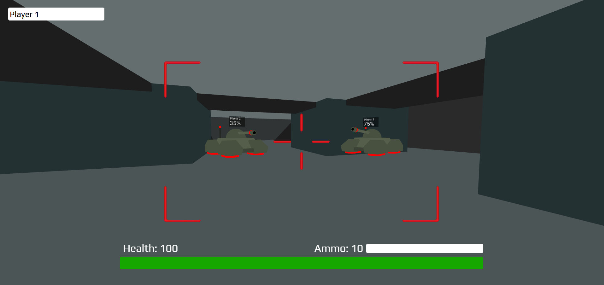

<h1> A-Frame Multiplayer Concept </h1>

An online multiplayer game

Play: https://multiplayer-tanks.netlify.app/
<ul>
  <li>To see the multiplayer aspect in action, open the game in two different browsers or use an incognito tab</li>
</ul>

<h2>How to run locally</h2>
<ul>
  <li>Open <code>index.html</code> in a web browser</li>
</ul>

<h2>Technologies Used</h2>
<ul>
  <li> Firebase Realtime Database to synchronize player and environment changes </li>
  <li> A-Frame WebVR to construct 3D environment </li>
</ul>

<h2> Instructions </h2>
<li> Move - WASD or Arrow Keys </li>
<li> Throw Sushi - SPACE </li>
